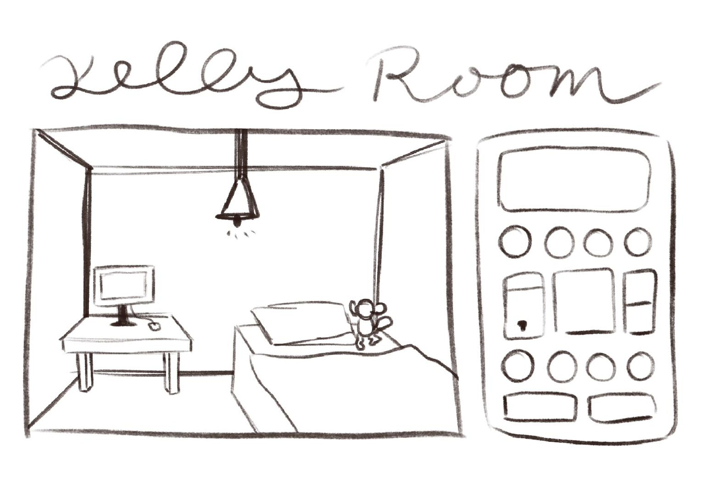
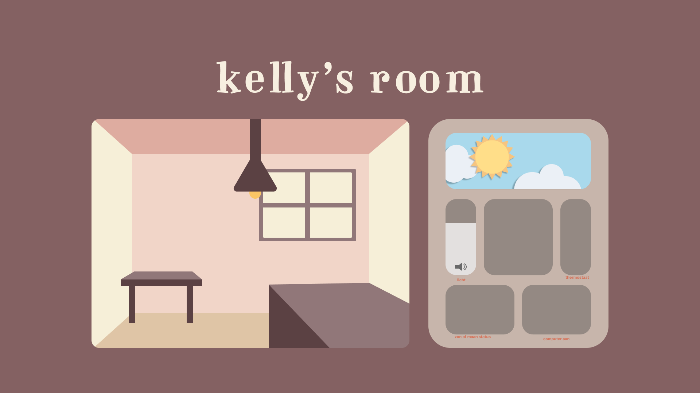

# web-dd-css-kelly-kha

## Week 2  - woensdag 4 maart
- Wat heb ik vandaag gedaan?

Vandaag waren we eerst begonnen met de weekly nerd en hierna heb ik de opdrachten bekeken en moest ik nog even een beetje oriënteren welke ik wilde doen. Uiteindelijk heb ik de keuze gemaakt voor de control panel. Verder heb ik de workshop over gradients gevolgd van sanne en gelijk daarna de workshop van nils over advanced layouts tot half 2. 

Na de workshops hebben we even een pauze genomen en ik heb daarna om 14.00 even zitten bedenken wat ik wilde doen voor de control panel en was tot 2 keuzes gekomen namelijk een game character customizer of een control panel voor een huis.

Eerst had ik een beetje in vs code uitgeprobeerd voor de game character, maar ik ga toch voor de huis idee.

- Wat heb ik geleerd?

Ik heb nieuws geleerd over gradients en over repeating en animeren daarbij en bij nils meer geleerd over grids bijv auto fit  vs auto fill

- Wat ga ik morgen doen?

ik ga morgen een begin maken aan het huis idee en ik moet eerst nog bedenken wat ik erin wil en hoe ik dat ga doen.

## Week 2  - donderdag 5 maart
- Wat heb ik vandaag gedaan?

vandaag had ik de workshop van nils gevolgd over @property en ben ik aan de slag geweest met m’n design.  Dit had ik eerst geprobeerd gelijk in de code, maar het lukte me na een tijd niet om verder komen omdat ik geen goed zicht had. 

 Toen besloot ik om toch even over te stappen naar Figma om een me-fi te maken voor de kamer.

## Week 2  - vrijdag 6 maart
- Wat heb ik vandaag gedaan?
